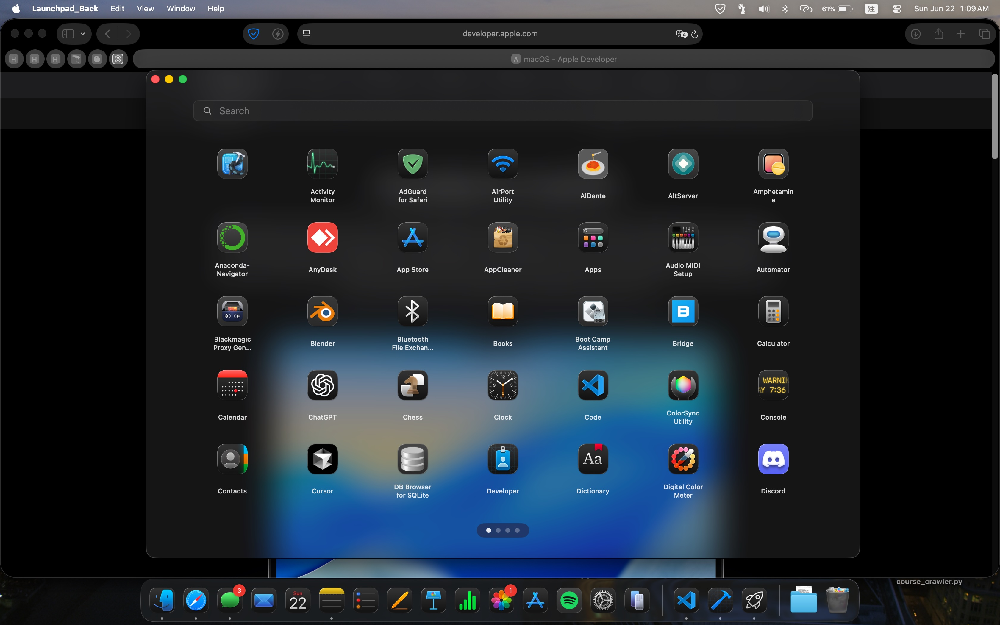

# Launchpad_Back (English)

## Description

As macOS 26 Tahoe removed the native Launchpad, this SwiftUI application was created for convenience to replicate its core functionality. It provides a user-friendly interface to view, search, and launch installed applications in a familiar grid-based, paginated layout.

## Features

*   **Application Discovery**: Automatically scans and displays all applications from standard macOS directories (`/Applications`, `/System/Applications`, and `/System/Applications/Utilities`).
*   **Grid Layout & Pagination**: Arranges apps in a clean grid. If there are more apps than can fit on one screen, they are organized into multiple pages.
*   **Smooth Navigation**: Users can navigate between pages using:
    *   A two-finger swipe gesture on the trackpad.
    *   A click-and-drag gesture with the mouse.
    *   Arrow keys.
*   **Real-time Search**: A search bar at the top allows users to instantly filter applications by name.
*   **Visual Appeal**: Features a blurred, translucent background effect that mimics the native macOS Launchpad (an attempt was made to create a Liquid Glass effect, but it proved too difficult).
*   **Keyboard Shortcuts**:
    *   `Cmd + W`: Close the Launchpad window.
    *   `Cmd + Q`: Quit the application.
    *   `Esc`: Clear the search field or close the window if the search is empty.
    *   `Arrow Keys`: Switch pages.
*   **Performance**:
    *   App scanning is performed on a background thread to keep the UI responsive.
    *   App icons are loaded asynchronously and cached.

## How It Works

*   **`LaunchpadViewModel`**: This is the core of the application's logic. It's responsible for finding all `.app` bundles, parsing their `Info.plist` to get metadata (like name and bundle ID), handling duplicates, and providing the final list of apps to the view.
*   **`ContentView`**: This file contains all the SwiftUI views that make up the user interface.
    *   `LaunchpadView`: The main view that orchestrates all other components.
    *   `PageView`: Represents a single page in the grid.
    *   `AppIcon`: A view for an individual application icon and its name.
    *   `SearchBar`: The search component.
    *   `PageIndicator`: The dots at the bottom indicating the current page.
*   **Gesture & Event Handling**: The app uses a combination of `DragGesture` for mouse dragging, a custom `NSViewRepresentable` (`TouchpadScrollView`) to detect trackpad scrolling, and `NSEvent.addLocalMonitorForEvents` to listen for global keyboard events.
