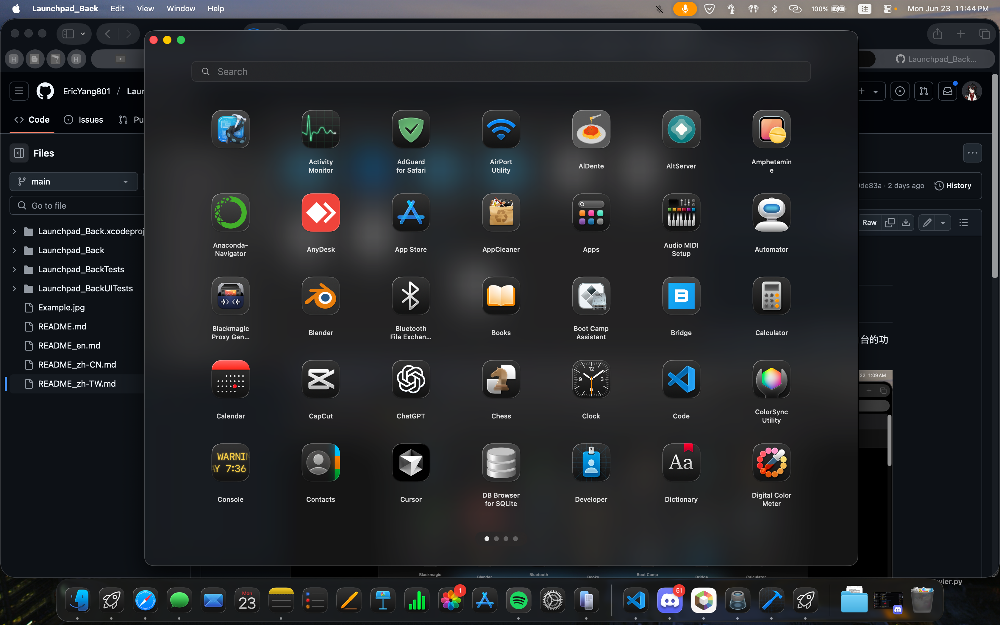

# Launchpad_Back

> 一款使用 SwiftUI 开发的 macOS 应用程序，用于模拟原生 macOS 启动台功能

**[English](./README.md) | [繁体中文](./README_zh-TW.md) | [简体中文](./README_zh-CN.md)**

## 界面演示
 

##  概述

Launchpad_Back 是一款基于 SwiftUI 开发的 macOS 应用程序，因为 Apple 在 macOS 26 Tahoe 移除了启动台，所以提供一种替代方法。

**状态**:  功能完整 | **平台**: macOS 15+ | **语言**: Swift/SwiftUI

##  主要功能

### 核心功能
- **应用程序搜索**: 自动扫描并显示来自以下位置的所有应用程序：
  - `/Applications`
  - `/System/Applications`
  - `/System/Applications/Utilities`
  - 用户应用程序目录
  - Homebrew Cask 应用程序

- **网格布局**:
  - 整齐的应用程序图标网格排列
  - 自动分页

- **多种手势及快捷键**:
  - 触控板双指滑动手势
  - 鼠标点击并拖拽手势
  - 方向键进行页面导航
  - 键盘快捷键支持

### 用户界面
- **与原生启动台一致的设计**:
  - 深色主题，配备模糊的半透明背景
  - 灵感来自原生 macOS 启动台美学
  - 流畅的动画和过渡效果

- **⌨键盘快捷键**:
  - `Cmd + L`: 切换启动台可见性（全局热键）
  - `Cmd + W`: 关闭启动台窗口
  - `Cmd + Q`: 退出应用程序
  - `Esc`: 清除搜索或关闭窗口
  - `方向键`: 在页面之间导航

### 性能与可靠性
- **后台处理**: 应用程序扫描在后台线程上进行，保持用户界面的响应性
- **缓存**: 应用程序图标异步加载并缓存以加快访问速度
- **错误处理**: 全面错误处理和日志记录
- **自动保存**: 保存应用程序顺序和文件夹配置

### 高级功能
- **文件夹组织**: 将应用程序分组到自定义文件夹中
- **拖放支持**: 通过拖拽手势重新组织应用程序并创建文件夹
- **编辑模式**: 管理应用程序组织和文件夹
- **重复处理**: 防止重复应用程序出现

## 架构

### 项目结构

```
Launchpad_Back/
├── Models/
│   └── AppItem.swift              # 应用程序数据模型
├── Services/
│   ├── AppScannerService.swift    # 应用程序发现和扫描
│   ├── AppLauncherService.swift   # 应用程序启动
│   ├── AppIconCache.swift         # 图标缓存和管理
│   ├── KeyboardEventManager.swift # 全局键盘事件处理
│   ├── GestureManager.swift       # 手势识别和处理
│   ├── GridLayoutManager.swift    # 网格布局计算
│   └── Logger.swift               # 应用程序日志记录
├── ViewModels/
│   ├── LaunchpadViewModel.swift   # 主应用程序状态管理
│   ├── SearchViewModel.swift      # 搜索功能
│   ├── PaginationViewModel.swift  # 页面导航逻辑
│   └── EditModeManager.swift      # 编辑模式状态管理
├── Views/
│   ├── ContentView.swift          # 主用户界面容器
│   ├── LaunchpadView.swift        # 主要视图编排
│   ├── PageView.swift             # 单个页面呈现
│   ├── AppIconView.swift          # 应用程序图标组件
│   ├── SearchBarView.swift        # 搜索界面
│   ├── PageIndicatorView.swift    # 页面指示器点
│   ├── TouchpadScrollView.swift   # 触控板滚动处理
│   ├── FolderExpandedView.swift   # 文件夹展开用户界面
│   ├── BackgroundView.swift       # 背景样式设置
│   └── ...
└── Assets/                        # 图片和应用程序图标
```

### 关键组件

#### **LaunchpadViewModel** 
- 核心应用程序状态管理
- 处理应用程序发现和文件夹操作
- 管理显示项目顺序
- 协调服务和视图之间的协作

```swift
@Published var apps: [AppItem]
@Published var folders: [AppFolder]
@Published var displayItems: [LaunchpadDisplayItem]
@Published var isLoading: Bool
```

#### **AppScannerService** 
- 扫描系统目录以寻找 `.app` 包
- 从 `Info.plist` 文件提取元数据
- 处理重复检测和筛选
- 支持多个搜索路径：
  - 系统应用程序
  - 用户应用程序
  - Homebrew Cask

#### **AppLauncherService** 
- 按路径或包标识符启动应用程序
- 支持同步和异步启动
- 优雅地处理启动失败

#### **KeyboardEventManager**
- 全局键盘事件监控
- 处理方向键、Escape 和修饰符组合
- 使用 Cmd+L 切换窗口可见性

#### **GestureManager** 
- 管理鼠标拖拽手势
- 处理触控板滚动检测
- 支持跨页面和跨文件夹拖拽

#### **AppIconCache** 
- 异步图标加载
- NSImage 缓存和获取
- 若图标不可用则回退至应用程序名称显示

## 安装及编译说明

### 系统需求
- **macOS**: 15.0 或更新版本

### 安装与编译

1. **克隆项目库**:
   ```bash
   git clone https://github.com/yourusername/Launchpad_Back.git
   cd Launchpad_Back
   ```

2. **在 Xcode 中打开项目**:
   ```bash
   open Launchpad_Back.xcodeproj
   ```

3. **编译并运行**:
   - 选择您的 Mac 作为目标设备
   - 按 `Cmd + R` 进行编译和运行
   - 或在菜单中使用 Product → Run

### 安装为应用程序

编译后，您可以安装该应用程序：

1. 在 Xcode 的编译目录中找到生成的 `.app`
2. 将其复制到 `/Applications`
3. 从应用程序文件夹或 Spotlight 搜索启动

##  使用指南

### 基本操作

1. **启动应用程序**:
   - 点击任何应用程序图标即可启动
   - 点击文件夹图标即可展开并查看内容

2. **搜索应用程序**:
   - 点击搜索栏或开始输入
   - 结果即时筛选
   - 按 `Esc` 清除搜索

3. **在页面之间导航**:
   - 使用方向键在页面之间移动
   - 在触控板上用双指滑动
   - 用鼠标点击并拖拽

4. **编辑应用程序排序**:
   - 按按钮进入编辑模式
   - 拖拽应用程序以重新排列
   - 将应用程序拖拽到彼此上方以创建文件夹

### 全局热键

- **`Cmd + L`**: 从任何应用程序切换启动台可见性


## 技术详细信息

### 数据模型

#### **AppItem**
```swift
struct AppItem: LaunchpadItem {
    let id: UUID
    let name: String
    let bundleID: String
    let path: String
    let isSystemApp: Bool
    var displayOrder: Int
}
```

#### **LaunchpadDisplayItem** (枚举)
```swift
enum LaunchpadDisplayItem {
    case app(AppItem)
    case folder(AppFolder)
}
```

#### **AppFolder**
```swift
struct AppFolder: LaunchpadItem {
    let id: UUID
    var name: String
    var apps: [AppItem]
    var displayOrder: Int
}
```

### 状态管理

应用程序使用 MVVM 模式和 Combine 框架：
- `@StateObject` 用于 ViewModel 生命周期管理
- `@EnvironmentObject` 用于跨视图状态共享
- `@Published` 用于响应式状态更新
- `ObservableObject` 协议用于视图同步

### 持久化

应用程序状态使用 `UserDefaults` 进行持久化：
- **launchpad_item_order**: 已显示项目的顺序
- **launchpad_folders**: 文件夹定义和内容

## 已知问题与限制

- 仅限于具有有效 `.app` 包的应用程序
- 自定义文件夹图标目前不支持

## 许可证

本项目采用 MIT 许可证。详见 [LICENSE](./LICENSE) 文件。

## 作者

**Eric_Yang**
- 创建日期：2025 年 6 月
- 上次更新：2026 年 1 月

## 问题或建议 
如果有任何问题或建议，欢迎使用 GitHub 提 issue 或 pull request！
