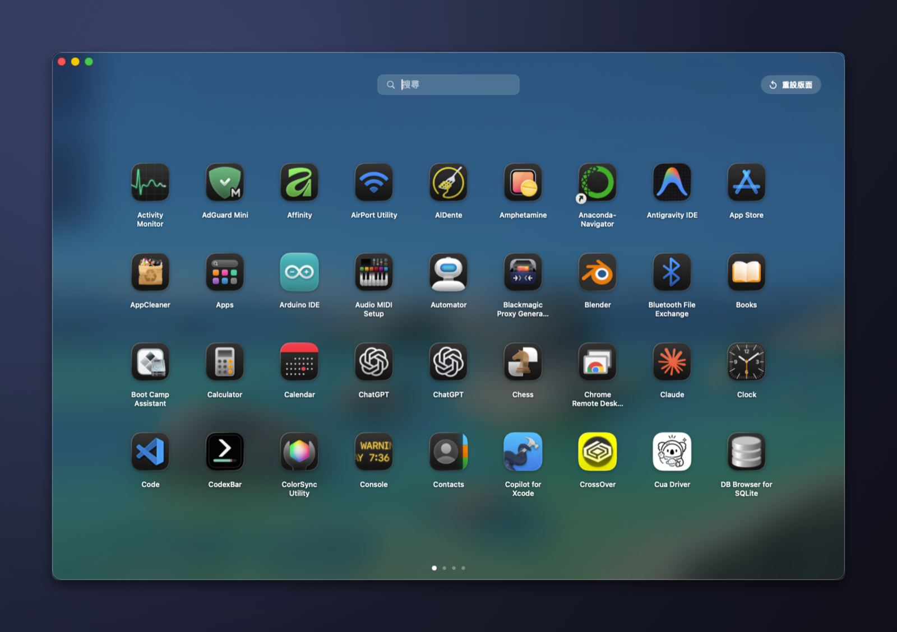
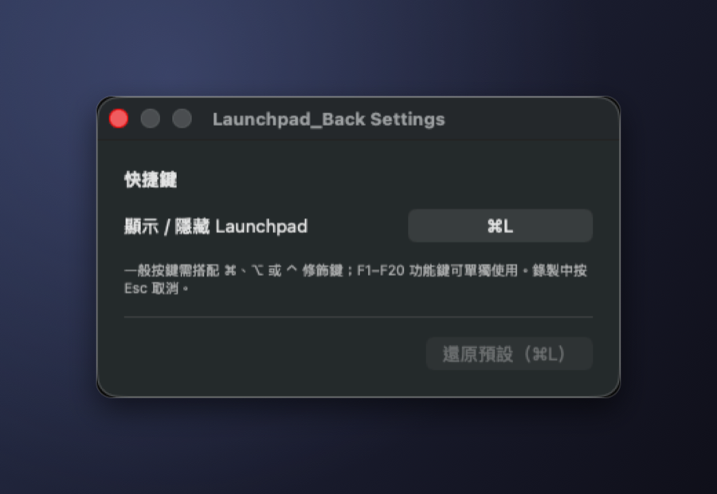

# Launchpad_Back

> 用 SwiftUI + AppKit 写的 macOS Launchpad 替代启动器（macOS 15.6+）。

<div align="center">
  
</div>

**[English](./README.md) | [繁体中文](./README_zh-TW.md) | [简体中文](./README_zh-CN.md)**

如果你在找“macOS Tahoe 的 Launchpad 替代品”，这个项目就是为这个场景做的：全局快捷键呼出、分页网格、文件夹整理、拖拽排序和本地搜索。

## 界面演示



在设置（`Cmd + ,`）中重新绑定全局快捷键：



## 安装

到 [最新 Release](https://github.com/EricYang801/Launchpad_Back/releases/latest) 下载 `Launchpad_Back.app.zip`，解压后把 `Launchpad_Back.app` 移到 `/Applications`。

App 采用 ad-hoc 签名而非公证（notarization），因此首次打开会被 macOS 拦截。请在 App 上右键选择「**打开**」并确认，或到「**系统设置 → 隐私与安全性**」允许运行。

## 搜索关键词

Launchpad 替代, macOS app launcher, SwiftUI 启动器, AppKit launcher, 全局快捷键启动器, macOS Tahoe Launchpad replacement, Homebrew Cask 扫描

## 当前功能（按现有代码）

- 浮动窗口启动器，可通过全局快捷键切换显示（默认 `Cmd + L`，可在设置中自定义）
- 开关具有 Launchpad 风格的缩放淡入淡出动画；启动 App 或点击窗口外部即关闭
- 输入即开始搜索，按 `Return` 启动第一个结果
- 响应式分页网格（动态 5-9 列、3-7 行）
- 支持拖拽排序、文件夹创建/重命名、从展开文件夹拖出 App
- 搜索会匹配 App 名称、bundle ID、安装路径（不区分大小写）
- 扫描系统、用户和 Homebrew 常见安装目录
- 图标处理包含 workspace icon、metadata fallback 和自动 fallback icon

## 快捷键与手势

| 输入 | 行为 |
| --- | --- |
| 全局快捷键（默认 `Cmd + L`，可在设置 / `Cmd + ,` 自定义） | 全局切换启动器显示/隐藏 |
| 直接打字 | 字符直接进入搜索栏（即输即搜） |
| `Return` | 启动第一个搜索结果 |
| `Cmd + W` | 隐藏窗口 |
| `Cmd + Q` | 退出程序 |
| `Cmd + ,` | 打开设置 |
| `Esc` | 依次：退出编辑模式 -> 关闭文件夹 -> 清空搜索 -> 隐藏窗口 |
| `Left` / `Up` | 上一页（搜索为空时） |
| `Right` / `Down` | 下一页（搜索为空时） |
| 点击窗口外部 | 隐藏启动器 |
| 触控板滚动手势 | 页面实时跟随手指，松开时翻页或弹回 |
| 鼠标滚轮 | 按 notch 累积和防抖切页 |

## 设置

按 `Cmd + ,` 打开设置窗口，可重新录制全局切换快捷键：点一下快捷键按钮，再按下新的组合即可。

- 普通按键需搭配 `Cmd`、`Opt` 或 `Ctrl`
- `F1`–`F20` 可单独绑定，因此能设成原版 Launchpad 的 `F4`
- 录制中按 `Esc` 取消
- 更改后立即重新注册，重开 App 仍会保留

## 应用扫描路径

| 路径 | 是否递归 |
| --- | --- |
| `/System/Applications` | 否 |
| `/System/Applications/Utilities` | 否 |
| `/Applications` | 否 |
| `/Applications/Utilities` | 否 |
| `~/Applications` | 否 |
| `/opt/homebrew/Caskroom` | 是 |

扫描器还会过滤一批隐藏/后台系统 App，并使用稳定标识去重（优先 `bundleID`，没有时回退到路径）。

## 文件夹与版面逻辑

- 长按图标进入编辑模式
- 把 App 拖到另一个 App 上可创建文件夹（默认名 `New Folder`）
- 把 App 拖到文件夹上可加入文件夹
- 展开文件夹后可重命名、可重排内部项目
- 从展开文件夹拖出 App 可移出文件夹
- 当文件夹只剩 1 个 App 时会自动解散
- 重设版面会清空自定义排序和文件夹，恢复按名称排序

## 图标处理流程

- 先解析 symlink / canonical bundle path
- 如果 `NSWorkspace` 返回的不是 generic icon，直接使用
- 如果是 generic icon，则继续读取 bundle metadata（`CFBundleIconFile`、`CFBundleIconName` 等）
- metadata 仍然不可用时，生成一致的 initials fallback icon
- 使用异步缓存并预加载相邻页图标，减少翻页和拖拽卡顿

## 持久化存储

Launchpad_Back 会把版面状态写入 `UserDefaults`：

- `launchpad_item_order`
- `launchpad_folders`
- `globalToggleHotKey`

## 项目结构

```text
Launchpad_Back/
├── Launchpad_BackApp.swift
├── ContentView.swift
├── Models/
│   └── AppItem.swift
├── Services/
│   ├── AppIconCache.swift
│   ├── AppIconResolver.swift
│   ├── AppLauncherService.swift
│   ├── AppScannerService.swift
│   ├── GestureManager.swift
│   ├── GridLayoutManager.swift
│   ├── GridScreenLayout.swift
│   ├── HotKeySettings.swift
│   ├── KeyboardEventManager.swift
│   └── Logger.swift
├── ViewModels/
│   ├── EditModeManager.swift
│   ├── LaunchpadViewModel.swift
│   ├── PaginationViewModel.swift
│   └── SearchViewModel.swift
├── Views/
│   ├── AppIconView.swift
│   ├── BackgroundView.swift
│   ├── FolderExpandedView.swift
│   ├── PageIndicatorView.swift
│   ├── SearchBarView.swift
│   └── SettingsView.swift
└── Assets.xcassets/
```

## 系统要求

- macOS 15.6 或更高版本
- Xcode 26.0 或更高版本

## 编译

1. 克隆仓库：

   ```bash
   git clone https://github.com/EricYang801/Launchpad_Back.git
   cd Launchpad_Back
   ```

2. 用 Xcode 打开：

   ```bash
   open Launchpad_Back.xcodeproj
   ```

3. 运行：

- 选择 `My Mac`
- 按 `Cmd + R`

也可以在 Terminal 编译：

```bash
xcodebuild build -scheme Launchpad_Back -destination 'platform=macOS'
```

## 测试

运行单元测试：

```bash
xcodebuild test -scheme Launchpad_Back -destination 'platform=macOS' -only-testing:Launchpad_BackTests
```

当前测试覆盖：

- icon 解析（直接路径、symlink、metadata fallback、自动 fallback）
- icon cache（canonical path 复用、并发安全、in-flight async 合并）
- 文件夹创建/加入/移除/删除与排序恢复
- 重设版面行为
- 搜索匹配（名称、bundle ID、路径）
- 分页切片、边界检查和页码修正
- `SearchViewModel` 基础行为

## 许可证

本项目采用 GPL-3.0。详见 [LICENSE](./LICENSE)。
