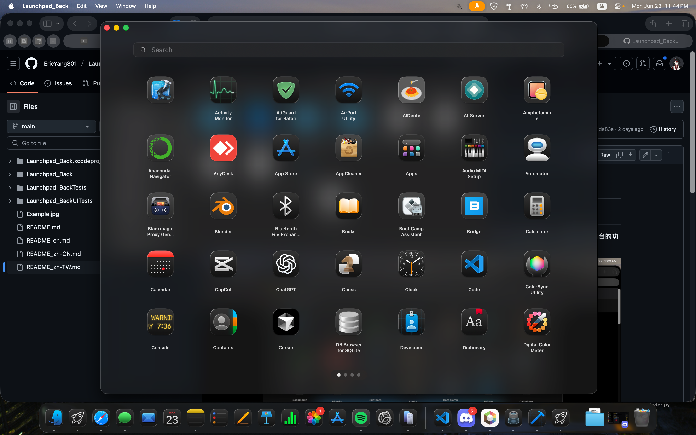

# Launchpad_Back

> 用 SwiftUI + AppKit 打造的 macOS Launchpad 替代方案（macOS 15.6+）。

<div align="center">
  
</div>

**[English](./README.md) | [繁體中文](./README_zh-TW.md) | [简体中文](./README_zh-CN.md)**

如果你在找「macOS Tahoe 的 Launchpad 替代品」，這個專案就是為那個場景做的：全域快捷鍵呼叫、分頁網格、資料夾整理、拖曳排序與本地搜尋。

## 畫面演示


## 搜尋關鍵詞

Launchpad 替代, macOS app launcher, SwiftUI 啟動器, AppKit launcher, 全域快捷鍵啟動器, macOS Tahoe Launchpad replacement, Homebrew Cask 掃描

## 目前功能（依現行程式碼）

- 浮動視窗啟動器，可用全域 `Cmd + L` 切換顯示
- 響應式分頁網格（動態 5-9 欄、3-7 列）
- 支援拖曳排序、資料夾建立/重新命名、從展開資料夾拖出 App
- 搜尋會比對 App 名稱、bundle ID、安裝路徑（不分大小寫）
- 掃描系統、使用者與 Homebrew 常見安裝位置
- 圖示流程包含 workspace icon、metadata fallback 與自動 fallback icon

## 操作鍵與手勢

| 輸入 | 行為 |
| --- | --- |
| `Cmd + L` | 全域切換啟動器顯示/隱藏 |
| `Cmd + W` | 隱藏視窗 |
| `Cmd + Q` | 結束程式 |
| `Esc` | 依序：退出編輯模式 -> 關閉資料夾 -> 清空搜尋 -> 隱藏視窗 |
| `Left` / `Up` | 上一頁 |
| `Right` / `Down` | 下一頁 |
| 觸控板捲動手勢 | 依閾值與冷卻時間切頁 |
| 滑鼠滾輪 | 依 notch 累積與防抖切頁 |

## 應用掃描路徑

| 路徑 | 是否遞迴 |
| --- | --- |
| `/System/Applications` | 否 |
| `/System/Applications/Utilities` | 否 |
| `/Applications` | 否 |
| `/Applications/Utilities` | 否 |
| `~/Applications` | 否 |
| `/opt/homebrew/Caskroom` | 是 |

掃描器也會過濾一批隱藏/背景系統 App，並用穩定識別鍵去重（優先 `bundleID`，沒有時退回路徑）。

## 資料夾與版面邏輯

- 長按圖示進入編輯模式
- App 拖到 App 上可建立資料夾（預設名 `New Folder`）
- App 拖到資料夾上可加入資料夾
- 展開資料夾後可重命名、可重排內部項目
- 從展開資料夾拖出 App 可移出資料夾
- 若資料夾剩 1 個 App，資料夾會自動解散
- 重設版面會清除自訂排序與資料夾，回到依名稱排序

## 圖示處理流程

- 先解析 symlink / canonical bundle path
- 若 `NSWorkspace` 回傳的不是 generic icon，直接使用
- 若是 generic icon，改讀 bundle metadata（`CFBundleIconFile`、`CFBundleIconName` 等）
- metadata 仍找不到時，生成一致性的 initials fallback icon
- 使用非同步快取與相鄰頁面預載，降低翻頁和拖曳卡頓

## 持久化儲存

Launchpad_Back 會把版面狀態存到 `UserDefaults`：

- `launchpad_item_order`
- `launchpad_folders`

## 專案結構

```text
Launchpad_Back/
├── Launchpad_BackApp.swift
├── ContentView.swift
├── Models/
│   └── AppItem.swift
├── Services/
│   ├── AppIconCache.swift
│   ├── AppIconResolver.swift
│   ├── AppLauncherService.swift
│   ├── AppScannerService.swift
│   ├── GestureManager.swift
│   ├── GridLayoutManager.swift
│   ├── KeyboardEventManager.swift
│   └── Logger.swift
├── ViewModels/
│   ├── EditModeManager.swift
│   ├── LaunchpadViewModel.swift
│   ├── PaginationViewModel.swift
│   └── SearchViewModel.swift
├── Views/
│   ├── AppIconView.swift
│   ├── BackgroundView.swift
│   ├── FolderExpandedView.swift
│   ├── PageIndicatorView.swift
│   └── SearchBarView.swift
└── Assets.xcassets/
```

## 系統需求

- macOS 15.6 或以上
- Xcode 26.0 或以上

## 編譯

1. 下載專案：

   ```bash
   git clone https://github.com/EricYang801/Launchpad_Back.git
   cd Launchpad_Back
   ```

2. 用 Xcode 開啟：

   ```bash
   open Launchpad_Back.xcodeproj
   ```

3. 執行：

- 選擇 `My Mac`
- 按 `Cmd + R`

也可以用 Terminal 編譯：

```bash
xcodebuild build -scheme Launchpad_Back -destination 'platform=macOS'
```

## 測試

執行單元測試：

```bash
xcodebuild test -scheme Launchpad_Back -destination 'platform=macOS' -only-testing:Launchpad_BackTests
```

目前測試包含：

- icon 解析（直接路徑、symlink、metadata fallback、自動 fallback）
- icon cache（canonical path 重用、並發安全、in-flight async 併單）
- 資料夾建立/加入/移除/刪除與排序還原
- 重設版面行為
- 搜尋比對（名稱、bundle ID、路徑）
- 分頁切片、邊界檢查與頁碼修正
- `SearchViewModel` 基本行為

## 授權

本專案採用 GPL-3.0。詳見 [LICENSE](./LICENSE)。
