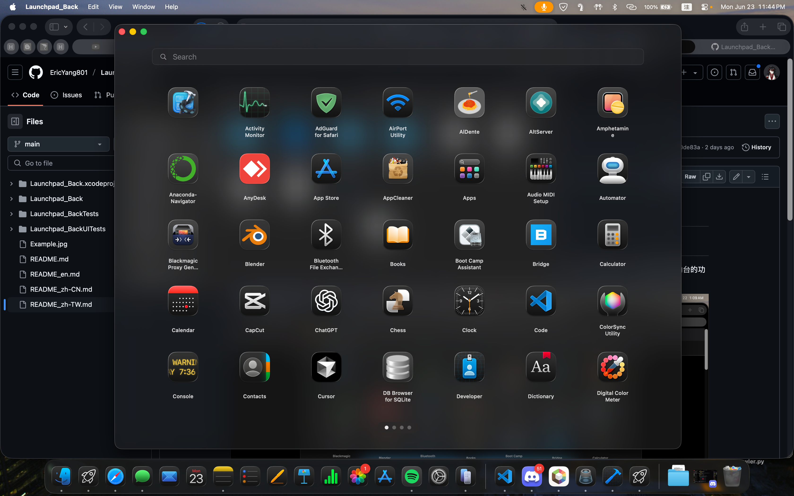

# Launchpad_Back

> 一個使用 SwiftUI 開發的 macOS 應用程式，用於模仿原生macOS啟動台功能

<div align="center">
  
</div>

**[English](./README.md) | [繁體中文](./README_zh-TW.md) | [简体中文](./README_zh-CN.md)**

## 畫面演示
 

##  概述

Launchpad_Back 是一款基於 SwiftUI 開發的 macOS 應用程式，因為 Apple 在 macOS 26 Tahoe 移除啟動台所以提供一種替代方法。

**狀態**:  功能完整 | **平台**: macOS 15+ | **語言**: Swift/SwiftUI

##  主要功能

### 核心功能
- **應用程式搜尋**: 自動掃描並顯示來自以下位置的所有應用程式：
  - `/Applications`
  - `/System/Applications`
  - `/System/Applications/Utilities`
  - 使用者應用程式目錄
  - Homebrew Cask 應用程式

- **網格佈局**:
  - 整潔的應用程式圖示網格排列
  - 自動進行分頁

- **多種手勢及快捷鍵**:
  - 觸控板兩指滑動手勢
  - 滑鼠點擊並拖曳手勢
  - 方向鍵進行頁面導航
  - 鍵盤快捷鍵支援

### 使用者介面
- **跟原生啟動台一樣的設計**:
  - 深色主題，配備模糊的半透明背景
  - 靈感來自原生 macOS 啟動台美學
  - 流暢的動畫和過渡效果

- **⌨鍵盤快捷鍵**:
  - `Cmd + L`: 切換啟動台可見性（全域熱鍵）
  - `Cmd + W`: 關閉啟動台視窗
  - `Cmd + Q`: 結束應用程式
  - `Esc`: 清除搜尋或關閉視窗
  - `方向鍵`: 在頁面之間導航

### 效能與可靠性
- **背景處理**: 應用程式掃描在背景執行緒上進行，保持使用者介面的回應性
- **快取**: 應用程式圖示非同步載入並快取以加快存取速度
- **錯誤處理**: 整個應用程式的全面錯誤處理和日誌記錄
- **自動儲存**: 儲存應用程式順序和資料夾配置

### 進階功能
- **資料夾組織**: 將應用程式分組到自訂資料夾中
- **拖放支援**: 通過拖曳手勢重新組織應用程式並建立資料夾
- **編輯模式**: 管理應用程式組織和資料夾
- **重複處理**: 防止重複應用程式出現

## 架構

### 項目結構

```
Launchpad_Back/
├── Models/
│   └── AppItem.swift              # 應用程式數據模型
├── Services/
│   ├── AppScannerService.swift    # 應用程式發現和掃描
│   ├── AppLauncherService.swift   # 應用程式啟動
│   ├── AppIconCache.swift         # 圖示快取和管理
│   ├── KeyboardEventManager.swift # 全域鍵盤事件處理
│   ├── GestureManager.swift       # 手勢辨識和處理
│   ├── GridLayoutManager.swift    # 網格佈局計算
│   └── Logger.swift               # 應用程式日誌記錄
├── ViewModels/
│   ├── LaunchpadViewModel.swift   # 主應用程式狀態管理
│   ├── SearchViewModel.swift      # 搜尋功能
│   ├── PaginationViewModel.swift  # 頁面導航邏輯
│   └── EditModeManager.swift      # 編輯模式狀態管理
├── Views/
│   ├── ContentView.swift          # 主使用者介面容器
│   ├── LaunchpadView.swift        # 主要檢視編排
│   ├── PageView.swift             # 單個頁面呈現
│   ├── AppIconView.swift          # 應用程式圖示元件
│   ├── SearchBarView.swift        # 搜尋介面
│   ├── PageIndicatorView.swift    # 頁面指示器點
│   ├── TouchpadScrollView.swift   # 觸控板捲動處理
│   ├── FolderExpandedView.swift   # 資料夾展開使用者介面
│   ├── BackgroundView.swift       # 背景樣式設定
│   └── ...
└── Assets/                        # 圖片和應用程式圖示
```

### 關鍵元件

#### **LaunchpadViewModel** 
- 核心應用程式狀態管理
- 處理應用程式發現和資料夾操作
- 管理顯示項目順序
- 協調服務和檢視之間的協作

```swift
@Published var apps: [AppItem]
@Published var folders: [AppFolder]
@Published var displayItems: [LaunchpadDisplayItem]
@Published var isLoading: Bool
```

#### **AppScannerService** 
- 掃描系統目錄以尋找 `.app` 套件
- 從 `Info.plist` 檔案提取中繼資料
- 處理重複偵測和篩選
- 支援多個搜尋路徑：
  - 系統應用程式
  - 使用者應用程式
  - Homebrew Cask

#### **AppLauncherService** 
- 按路徑或套件識別碼啟動應用程式
- 支援同步和非同步啟動
- 優雅地處理啟動失敗

#### **KeyboardEventManager**
- 全域鍵盤事件監控
- 處理方向鍵、Escape 和修飾符組合
- 使用 Cmd+L 切換視窗可見性

#### **GestureManager** 
- 管理滑鼠拖曳手勢
- 處理觸控板捲動偵測
- 支援跨頁面和跨資料夾拖曳

#### **AppIconCache** 
- 非同步圖示載入
- NSImage 快取和擷取
- 若圖示無法使用則回退至應用程式名稱顯示

## 安裝及編譯說明

### 系統需求
- **macOS**: 15.0 或更新版本

### 安裝與編譯

1. **複製專案庫**:
   ```bash
   git clone https://github.com/yourusername/Launchpad_Back.git
   cd Launchpad_Back
   ```

2. **在 Xcode 中開啟項目**:
   ```bash
   open Launchpad_Back.xcodeproj
   ```

3. **編譯並執行**:
   - 選擇您的 Mac 作為目標裝置
   - 按 `Cmd + R` 進行編譯和執行
   - 或在選單中使用 Product → Run

### 安裝為應用程式

編譯後，您可以安裝該應用程式：

1. 在 Xcode 的編譯目錄中找到內建的 `.app`
2. 將其複製到 `/Applications`
3. 從應用程式資料夾或 Spotlight 搜尋啟動

##  使用指南

### 基本操作

1. **啟動應用程式**:
   - 點擊任何應用程式圖示即可啟動
   - 點擊資料夾圖示即可展開並查看內容

2. **搜尋應用程式**:
   - 點擊搜尋列或開始輸入
   - 結果即時篩選
   - 按 `Esc` 清除搜尋

3. **在頁面之間導航**:
   - 使用方向鍵在頁面之間移動
   - 在觸控板上用兩指滑動
   - 用滑鼠點擊並拖曳

4. **編輯應用程式排序**:
   - 按按鈕進入編輯模式
   - 拖曳應用程式以重新排列
   - 將應用程式拖曳到彼此上方以建立資料夾

### 全域熱鍵

- **`Cmd + L`**: 從任何應用程式切換啟動台可見性


## 技術詳細資訊

### 數據模型

#### **AppItem**
```swift
struct AppItem: LaunchpadItem {
    let id: UUID
    let name: String
    let bundleID: String
    let path: String
    let isSystemApp: Bool
    var displayOrder: Int
}
```

#### **LaunchpadDisplayItem** (列舉)
```swift
enum LaunchpadDisplayItem {
    case app(AppItem)
    case folder(AppFolder)
}
```

#### **AppFolder**
```swift
struct AppFolder: LaunchpadItem {
    let id: UUID
    var name: String
    var apps: [AppItem]
    var displayOrder: Int
}
```

### 狀態管理

應用程式使用 MVVM 模式和 Combine 框架：
- `@StateObject` 用於 ViewModel 生命週期管理
- `@EnvironmentObject` 用於跨檢視狀態共享
- `@Published` 用於反應性狀態更新
- `ObservableObject` 協議用於檢視同步

### 持久化

應用程式狀態使用 `UserDefaults` 進行持久化：
- **launchpad_item_order**: 已顯示項目的順序
- **launchpad_folders**: 資料夾定義和內容

## 已知問題與限制

- 僅限於具有有效 `.app` 套件的應用程式
- 自訂資料夾圖示目前不支援

## 授權

本專案採用 GPL-3.0 授權協議。詳見 [LICENSE](./LICENSE) 檔案。

## 作者

**Eric_Yang**
- 建立日期：2025 年 6 月
- 上次更新：2026 年 1 月

## 問題或是建議 
如果有任何問題或是建議，歡迎使用 GitHub 提出 issue 或 pull request！

